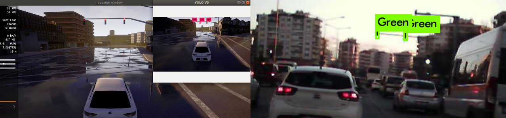
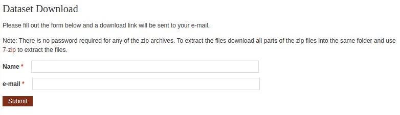
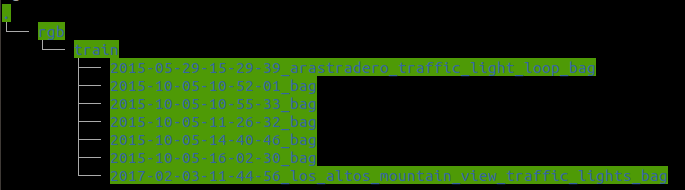
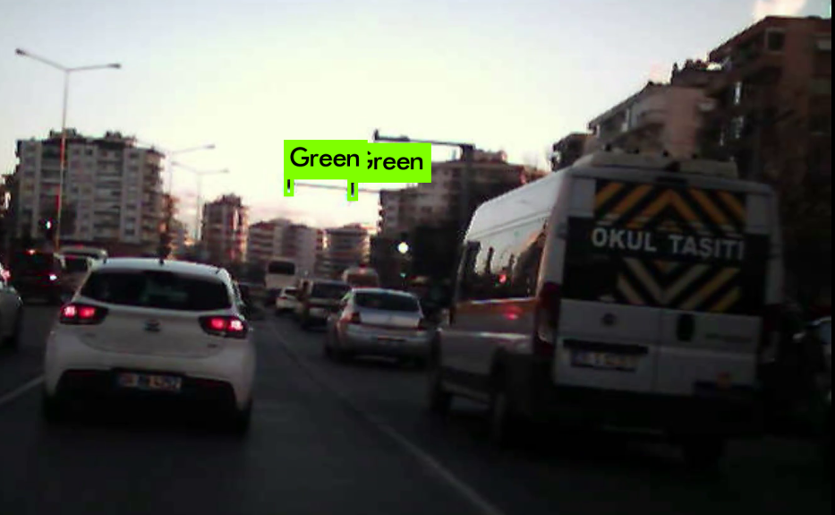
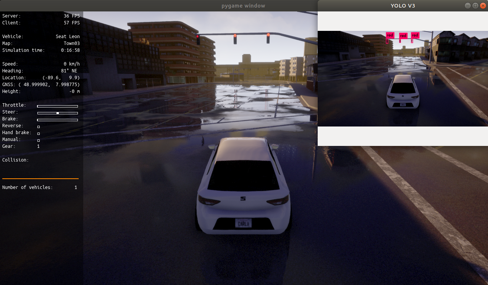

# Detecting Traffic Lights in Real-time with YOLOv3

### **UPDATE:** I revisited the Repo to make it easier to follow and there was an update in PyYaml which caused some error. Please revert to <a href="https://github.com/berktepebag/Traffic-light-detection-with-YOLOv3-BOSCH-traffic-light-dataset/tree/e55e09257433872089b9d148499eb976e2aca2b4">this commit<a/> if you were following this tutorial before 22 October 2021. If you are a new comer, please test the code and if you see any problems let me know. Best.

YOLOv3 is a real-time object detection system, and it runs really fast on the CUDA supported GPUs (NVIDIA). So our aim is to train the model using the Bosch Small Traffic Lights Dataset and run it on images, videos and Carla simulator. Finally we will try it on NVIDIA Jetson Nano, which is a very small and capable SoC.



First start with downloading Bosch Small Traffic Lights Dataset:

https://hci.iwr.uni-heidelberg.de/node/6132

In order to download dataset we have to register and a code will be sent to our e-mail address:



Dataset is around 6 GB, so it will take a while to download it. When download is done you should be using 7-zip to open it (In Ubuntu Archieve Manager is not opening the zipped file!).



After extracting we see that we have 7 different folders and 5093 images which is a good number for training traffic lights.


Obviously we could write our own classifier, a Convolutional Neural Network (CNN), but then it will not be possible to run it realtime so we will use YOLOv3. 

## YOLOv3

One of the best thing about YOLO is that it is running out of the box and supports well known datasets such as Pascal VOC, COCO and Open Images dataset. You can follow the <a href='https://pjreddie.com/darknet/yolo/' >YOLO offical page</a> to proceed with setup and for more details. Let's clone and make it with:

```html
git clone https://github.com/pjreddie/darknet
cd darknet
make
```

Now we need some example weights to run YOLO, download it from <a href="https://pjreddie.com/media/files/yolov3.weights">here</a> and save it into darknet folder.

Now we can run an example:

```html
./darknet detect cfg/yolov3.cfg yolov3.weights data/dog.jpg
```

A result image will appear and we can see that YOLO found a dog, a bicycle and a truck. YOLO can be used for multiple images, with webcam and videos. I will not go into details here as you can follow the original YOLO website so I would like to show you how to prepare the dataset and train it.

## Preparing the Dataset for Traning

As we already know that we need labels for the input images. In a standart CNN it would be a label for each image but since we are looking for parts of one image we need more than this. So YOLO is asking for a .txt file for each image as:
```html
<object-class> <x> <y> <width> <height>
```

Bosch Small Traffic Lights Dataset is coming with a Python script which turns the dataset into Pascal-VOC like dataset. It is good because YOLO has a script for converting VOC dataset to YOLO styled input. First clone the repository into the extracted dataset folder:  
```html
git clone git@github.com:bosch-ros-pkg/bstld.git
```

If you already don't have SSH key and getting an error, you have to set one and link it to your Github account in order to clone this repository. You can follow <a href="https://help.github.com/en/articles/connecting-to-github-with-ssh"> Github tutorial for SSH</a>.

### Data Folders Preparation
**Warning:** Extracted folder has white spaces in it's name. Please avoid white spaces and replace them with '-' (i.e Bosch-Traffic-Light-Dataset). Otherwise paths will be unusable in some cases! 

To keep dataset in order we will create 3 folders under rgb/train/
1. traffic_light_images
2. traffic_light_xmls
3. traffic_light_labels

```html
cd rgb/train
```

Since images are in separate folders and it will be easier to manipulate them when they are in one folder let's put them all together under rgb/train/traffic_light_images folder.

```html
mkdir traffic_light_images
find . -type f -print0 | xargs -0 --no-run-if-empty cp --target-directory=traffic_light_images
```
If you do not want to waste your space you should change 'cp' with 'mv' to move the images instead of making a copy of them. Now we have all the images under traffic_light_images folder.


Now create xmls folder and run:

```html
mkdir traffic_light_xmls
```
**Update:** PyYaml's load function has been <a href=https://stackoverflow.com/questions/69564817/typeerror-load-missing-1-required-positional-argument-loader-in-google-col>deprecated</a>, so if you are getting an error with yaml.load() you should change bosch_to_pascal.py line 60 to yaml.safe_load() .


Now go back to top Bosch-Traffic-Light-Dataset folder and run bosch_to_pascal.py script from bstld, which will create necessary xml files for training with YOLO. Where first argument is PATH_TO_DATASET/train.yaml and second argument is rgb/train/traffic_light_xmls folder which we recently created:
```html
cd ../..
python bstld/bosch_to_pascal.py train.yaml rgb/train/traffic_light_xmls/
```

Now we have 5093 xml label files but we have to convert VOC to YOLO type labels with the script from darknet. So create a traffic_light_labels folder to /rgb/train/

```html
mkdir rgb/train/traffic_light_labels
```

### darknet/traffic-lights folder
Let's go back to the darknet folder and create a folder named traffic-lights. We will put our files in this folder to reach them easily.

```html
mkdir traffic-lights 
```

#### VOC -> YOLO
From darknet/scripts folder, make a copy of the voc_label.py and name it bosch_voc_to_yolo_converter.py and put it under traffic-lights folder. This script will convert VOC type labels to YOLO type labels.

```html
cp scripts/voc_label.py traffic-lights/bosch_voc_to_yolo_converter.py
```

Here we have to change classes names with our class names from the dataset.

```Python
import xml.etree.ElementTree as ET
import pickle
import os
from os import listdir, getcwd
from os.path import join
import sys

sets=['traffic_lights']

classes = ["RedLeft", "Red", "RedRight", "GreenLeft", "Green", "GreenRight", "Yellow", "off"]

def convert(size, box):
    dw = 1./(size[0])
    dh = 1./(size[1])
    x = (box[0] + box[1])/2.0 - 1
    y = (box[2] + box[3])/2.0 - 1
    w = box[1] - box[0]
    h = box[3] - box[2]
    x = x*dw
    w = w*dw
    y = y*dh
    h = h*dh
    return (x,y,w,h)

def convert_annotation(xml_path_input,file_folder,file_name):
    in_file = open('%s'%(xml_path_input))
    out_file = open('%s/%s.txt'%(file_folder,file_name), 'w')
    tree=ET.parse(in_file)
    root = tree.getroot()
    size = root.find('size')
    w = int(size.find('width').text)
    h = int(size.find('height').text)

    for obj in root.iter('object'):
        difficult = obj.find('difficult').text
        cls = obj.find('name').text
        if cls not in classes or int(difficult)==1:
            continue
        cls_id = classes.index(cls)
        xmlbox = obj.find('bndbox')
        b = (float(xmlbox.find('xmin').text), float(xmlbox.find('xmax').text), float(xmlbox.find('ymin').text), float(xmlbox.find('ymax').text))
        bb = convert((w,h), b)
        out_file.write(str(cls_id) + " " + " ".join([str(a) for a in bb]) + '\n')

wd = getcwd()

output_folder = str(sys.argv[1])
xmls_list = str(sys.argv[2])
images_folder = str(sys.argv[3])

for image_set in sets:
    if not os.path.exists(output_folder):
        os.makedirs(output_folder)
    xml_paths = open(xmls_list).read().strip().split()
    list_file = open('%s.txt'%(image_set), 'w')
    for xml_path in xml_paths:
        #print("xml path: ",xml_path)
        xml_name = xml_path.split('/')[-1]
        #print("xml name:",xml_name)
        image_name = xml_name.split('.')[0]
        #print("image name: ",image_name)
        #print(images_folder+'/%s.png\n'%(image_name))
        list_file.write(images_folder+'%s.png\n'%(image_name))
        convert_annotation(xml_path,output_folder,image_name)
    list_file.close()
 ```

And for the arguments, we have to give:
1. output_folder for .txt files (PATH_TO_DATASET/rgb/train/traffic_light_labels)
2. xmls_list which is a .txt file that has the paths to the xml files and (we will create next)
3. images folder path which we are going to use for training. (PATH_TO_DATASET/rgb/train/traffic_light_images)

We need the paths of the .xml files as a list in a .txt file, in order to get it we will write a little Python script:

```html
cd traffic-lights
subl make_xml_list.py
```

```Python
import os
import sys

xmls_path = sys.argv[1] #xml files path

xml_files = []

#r = root, d = directories, f = xml_files

for r,d,f in os.walk(xmls_path):
	for file in f:
		if '.xml' in file:
			xml_files.append(os.path.join(r, file)) #Gets the whole file xmls_path
			#xml_files.append(os.path.splitext(file)[0]) # Gets only the name of the file without extension,path etc.	

file_num = len(xml_files)
print("Length of the .xml xml_files: ", file_num)

if not open('bosch_traffic_light_xmls_list.txt','w'):
	os.makefile('bosch_traffic_light_xmls_list.txt')

labels = open('bosch_traffic_light_xmls_list.txt','w')

for xml in xml_files:
	labels.write(xml + '\n')

labels.close()

#for f in xml_files:
	#print(f)
```

Save and run it:

```html
python make_xml_list.py PATH_TO_DATASET/rgb/train/traffic_light_xmls/
```
It will create bosch_traffic_light_xmls_list.txt file.

Let's copy the data/voc.names to traffic-lights and name it voc-bosch.names:

```html
cp ../data/voc.names voc-bosch.names
subl voc-bosch.names
```

and replace the items with:

1. RedLeft
2. Red
3. RedRight
4. GreenLeft
5. Green
6. GreenRight
7. Yellow
8. off


Now we can convert VOC to YOLO format:

We will use the folder PATH_TO_DATASET/rgb/train/traffic_light_labels for outputs, 
recently created bosch_traffic_light_xmls_list.txt and 
PATH_TO_DATASET/rgb/train/traffic_light_images for training images.

```html
python bosch_voc_to_yolo_converter.py ~/Datasets/Bosch-Traffic-Light-Dataset/rgb/train/traffic_light_labels/ bosch_traffic_light_xmls_list.txt ~/Datasets/Bosch-Traffic-Light-Dataset/rgb/train/traffic_light_images/
```

We have to create train.txt and test.txt which are list of the paths' of the relative images. Write a basic splitter script named train_test_split.py:

```html
subl train_test_split.py
```

```Python
import glob, os
import numpy as np
from sklearn.model_selection import train_test_split
import sys

image_paths_file = sys.argv[1] #traffic_lights/traffic_lights.txt

# Percentage of images to be used for the test set (float between 0-1)
percentage_test = float(sys.argv[2]);

img_paths = []
img_paths = open(image_paths_file).read().strip().split()

X_train, X_test= train_test_split(img_paths, test_size=percentage_test, random_state=31)

with open('train.txt', 'a') as train_file:
	for train in X_train:
		train_file.write(train + '\n')

with open('test.txt', 'a') as test_file:
	for test in X_test:
		test_file.write(test + '\n')
```

It takes recently created traffic_lights.txt file as first argument and second argument split percentage between 0 to 1. 

```html
python train_test_split.py traffic_lights.txt 0.2
```
test.txt and train.txt is created.

Create a backup folder inside traffic-lights folder where we will save our weights as we train:

```html
mkdir backup
```

Make a copy of the cfg/voc.data and name it voc-bosch.data .

```html
cp ../cfg/voc.data voc-bosch.data
```
Open it:

```html
classes= 20
train  = /home/pjreddie/data/voc/train.txt
valid  = /home/pjreddie/data/voc/2007_test.txt
names = data/voc.names
backup = backup
```

classes shows the number of the labels we would like to classify. From the dataset we can see that main lights are RedLeft, Red, RedRight, GreenLeft, Green, GreenRight, Yellow and off. Feel free to add or extract the ones you like. So our classes will be '8'. train.txt and test.txt are the text files which has the paths of the image files. names, are labels' names and as mentioned before we should get them from the database. Let's start updating the voc-bosch.data:

```html
classes= 8
train  = traffic-lights/train.txt
valid  = traffic-lights/test.txt
names = traffic-lights/voc-bosch.names
backup = traffic-lights/backup
```

Now we need one more thing to do to start training. Copy yolov3-tiny.cfg from darknet/cfg folder into traffic-lights folder and name it yolov3-tiny-bosch.cfg .

```html
cp ../cfg/yolov3-tiny.cfg yolov3-tiny-bosch.cfg
```

Open it:

You will see line 5,6,7 is commented out, uncomment them:

```html
Training
batch=64
subdivisions=2
```

<a href="https://github.com/AlexeyAB/darknet#how-to-train-to-detect-your-custom-objects">Calculate number of filters: </a>

```html
filters= 3 x (5 + #ofclasses)
```

filters = 3 x (5+8) = 39

Change filters' size before '[yolo]' parameters (lines 127 and 171) with 39 and classes to 8 in '[yolo]' parameters (lines 135 and 177).

We will use the technique called transfer learning where we use the pre-trained VOC data and just change the end of the deep-neural-network.

Download <a href="https://pjreddie.com/media/files/darknet53.conv.74"> weights of the darknet53 model</a> and train:

```html
cd ..
./darknet detector train traffic-lights/voc-bosch.data traffic-lights/yolov3-tiny-bosch.cfg darknet53.conv.74
```

After training done (after 30000 images results are getting sufficient) try it with:
```html
./darknet detector demo traffic-lights/voc-bosch.data traffic-lights/yolov3-tiny-bosch.cfg traffic-lights/backup/yolov3-tiny-bosch_40000.weights <video file>
```

## Video Demo

Let's try our classifier with a video:

```html
./darknet detector demo traffic-lights/voc-bosch.data traffic-lights/yolov3-tiny-bosch.cfg traffic-lights//backup/yolov3-tiny-bosch_40000.weights <video file>
```


	
### Probable Problems with OpenCv
	
If you are having problem while running make with OpenCv=1:
	
1. <a href="https://stackoverflow.com/questions/55306007/how-to-compile-yolov3-with-opencv">Modify Makefile</a>
Change opencv -> opencv4
- LDFLAGS+= `pkg-config --libs opencv4` -lstdc++
- COMMON+= `pkg-config --cflags opencv4` 
2. <a href="https://stackoverflow.com/questions/64885148/error-iplimage-does-not-name-a-type-when-trying-to-build-darknet-with-opencv"> Modify /src/image_opencv.cpp</a>
	
Add:
- #include "opencv2/core/core_c.h"
- #include "opencv2/videoio/legacy/constants_c.h"
- #include "opencv2/highgui/highgui_c.h"
	
Change:
- IplImage ipl = m -> IplImage ipl = cvIplImage(m);

## YOLO ROS

Videos are good for showing the results but we need something more interactive which makes <a href="http://carla.org/">Carla simulator</a> a great choice. Carla has built in ROS connections so it makes it even better for our case. Follow the instructions on the website to start using Carla. We can write our own nodes for traffic light detection but still we would like to use YOLO for classifcation. Since we have weights, cfg and data files, we can use them with this <a href="https://github.com/leggedrobotics/darknet_ros">leggedrobotics/darknet_ros repository</a> that combines YOLO and ROS and makes our lives easier.


Once we clone the darknet_ros repository follow the instructions and run Carla server with:
```html
cd ~/UnrealEngine_4.22/carla/Dist/CARLA_Shipping_0.9.6-27-g8e2a15f3/LinuxNoEditor'

carla_srv_run='./CarlaUE4.sh -carla-server -windowed -ResX=320 -ResY=240 -benchmark -fps=10'
```
Clone, make and launch carla_ros_bridge:
```html
roslaunch carla_ros_bridge carla_ros_bridge.launch
```
Go to the carla/PythonAPI/examples folder and run:

```html
python manual_control.py --rolename=ego_vehicle
```

Finally launch darknet_ros:

```html
roslaunch darknet_ros darknet_ros.launch image:=/carla/ego_vehicle/camera/rgb/front/image_color
```


A new window will pop and show if any traffic lights are classified.

### References:

1. <a href="https://pjreddie.com/darknet/yolo/"> YOLOv3 Website </a>
2. <a href="https://hci.iwr.uni-heidelberg.de/node/6132"> BOSCH Traffic Lights Dataset</a>
3. <a href="https://github.com/bosch-ros-pkg/bstld"> Bosch Small Traffic Lights Dataset Github Repository</a>
4. <a href="https://www.learnopencv.com/training-yolov3-deep-learning-based-custom-object-detector/">  LearnOpenCV, Training YOLOv3 : Deep Learning based Custom Object Detector</a>
5. <a href="http://emaraic.com/blog/yolov3-custom-object-detector">EMARAIC, How to build a custom object detector using YOLOv3 in Python</a>
6. <a href="https://www.learnopencv.com/deep-learning-based-object-detection-using-yolov3-with-opencv-python-c/"> Deep Learning based Object Detection using YOLOv3 with OpenCV ( Python / C++ ) </a>
7. <a href="https://github.com/leggedrobotics/darknet_ros">YOLO ROS: Real-Time Object Detection for ROS Github Repository</a>
8. <a href="https://github.com/pjreddie/darknet/issues/568>YOLOv3"> Anchor Calculation Explained </a>
9. <a href="https://github.com/carla-simulator/ros-bridge"> Carla ROS bridge</a>
10. <a href="https://silvamfpedro.github.io/thesis-blog/index.html"> Study and Adaptation of the Autonomous Driving Simulator CARLA for ATLASCAR2</a>
